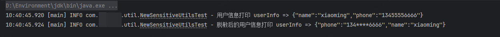
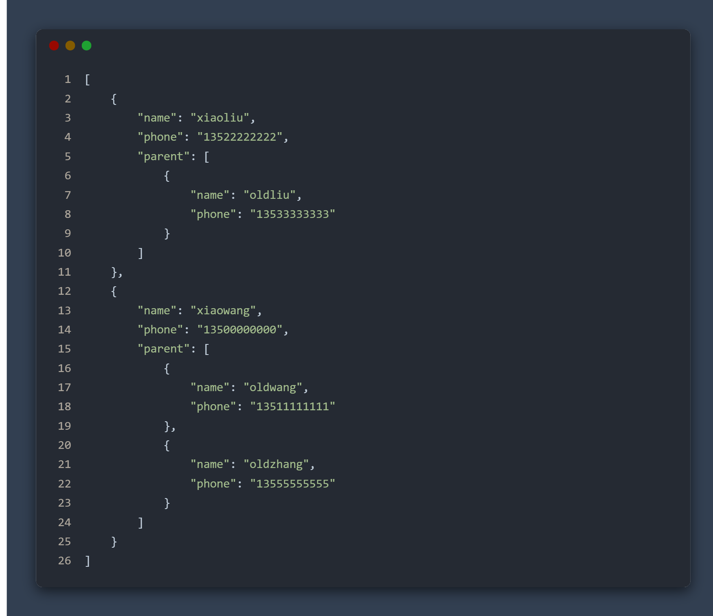
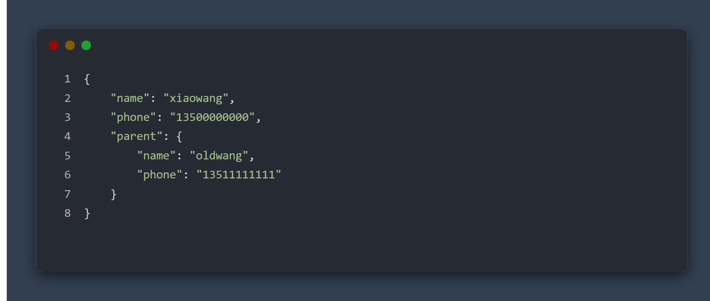

## 背景

在开发过程中，很容易将用户敏感信息，例如手机号码、身份证等，打印在日志平台。为了保护用户数据，又不影响日志的打印，需要将日志中的敏感信息进行脱敏。


## 效果




## 特性

1. 支持多层级Json/对象字段脱敏
2. 支持一次多字段脱敏
3. 支持除【连续数组层次（下面会举例）】脱敏

<br/>

## 使用

1. 输入为字符串/对象及单Json路径
   ```
   // 传入对象
   User user = new User();
   user.setName("xiaoming");
   user.setPhone("13455556666");
   String strResult4 = SensitiveUtils.desMobilePhone(user, "phone");
   System.out.println(strResult4); // {"phone":"134****6666","name":"xiaoming"}
   
   // 传入json字符串
   String str1 = "{\"name\":\"xiaoming\",\"phone\":\"13455556666\"}";
   String strResult5 = SensitiveUtils.desMobilePhone(str1, "phone");
   System.out.println(strResult5); // {"phone":"134****6666","name":"xiaoming"}
   ```

   <br/>
2. 输入为字符串/对象及多Json路径

    

   上图中，如果要脱敏全部手机号，路径则为 ：`phone` , `parent#phone`
   ```
   String str8 = "[{\"name\":\"xiaoliu\",\"phone\":\"13522222222\",\"parent\":[{\"name\":\"oldliu\",\"phone\":\"13533333333\"}]},{\"name\":\"xiaowang\",\"phone\":\"13500000000\",\"parent\":[{\"name\":\"oldwang\",\"phone\":\"13511111111\"},{\"name\":\"oldzhang\",\"phone\":\"13555555555\"}]}]";
   String strResult8 = SensitiveUtils.desMobilePhone(str8, new HashSet<>(Arrays.asList("phone", "parent#phone")));
   System.out.println(strResult8);
   ```

    

   上图中，如果要脱敏全部手机号，路径则为 ：`phone` , `parent#phone`
   ```
   String str9 = "{\"name\":\"xiaowang\",\"phone\":\"13500000000\",\"parent\":{\"name\":\"oldwang\",\"phone\":\"13511111111\"}}";
   String strResult9 = SensitiveUtils.desMobilePhone(str9, new HashSet<>(Arrays.asList("phone", "parent#phone")));
   System.out.println(strResult9);
   ```

<br/>

## 缺陷

1. 暂不支持连续俩层数组结构的JSON字符串/对象
    
2. 暂不支持对String以外类型脱敏
3. 暂不支持字符串中【对象JSON字符串】脱敏
   ```
   {
       "info": "{\"data\":\"{\\\"phone\\\":\\\"13444444444\\\"}\"}"
   }
   ```

## 未来优化方向

1. 不单单支持手机号脱敏，增加身份证等其他功能
2. 支持非String类型字段脱敏
3. 支持一个对象/Json字符串多种脱敏类型，例如：一个字符串同时脱敏手机号、身份证号
4. 连续数组脱敏（待定）
5. 字符串中【对象JSON字符串】脱敏（待定）
